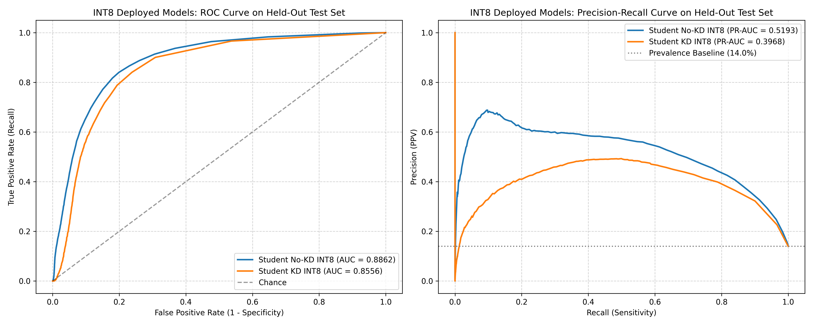

# Empirical Threshold Sweep & Operating Point Analysis Report

**Date:** 2026-09-20  
**Dataset Split:** Held-Out Test Set (`X_test.npy`, 51,992 windows across 8 test records, 7,278 ground-truth anomalies = 14.00% prevalence) `[MEASURED]`  
**Total ECG Test Duration:** 4.01 hours (14,442.2 seconds at 360 Hz, 100-sample step size) `[MEASURED]`  
**Continuous Baseline:** 51,992 windows x 400 bytes/window = 20,796,800 bytes (19.83 MB) `[ASSUMED]`  
**Measured Alert Payload:** 132.23 bytes/alert (AES-GCM encrypted metadata, 0 bytes raw ECG) `[MEASURED]`  
**Target Constraint (NFR-6):** > 90.0% Network Payload Reduction  

---

## 1. Executive Summary & Core Findings

This sweep evaluates the trade-off between **minority-class arrhythmia recall**, **precision / false alarm burden**, and **bandwidth reduction percentage** across decision thresholds $\tau \in [0.30, 0.95]$ in 0.05 increments.

> [!IMPORTANT]
> **Key Empirical Takeaways:**
> 1. **Massive Bandwidth Headroom Across All Thresholds:** Because the encrypted alert payload is only 132.23 bytes while the continuous baseline is 400 bytes per window, transmission rates up to **30.25%** still meet the 90.0% NFR-6 ceiling. Every single evaluated threshold from 0.30 to 0.95 comfortably achieves $> 96.8\%$ reduction.
> 2. **Failure of 0.85 Operating Point:** At $\tau=0.85$, the deployed No-KD INT8 model triggers on only 137 windows (0.26% rate), detecting only 49 of 7,278 anomalies (**0.67% recall**). While bandwidth reduction is 99.91%, 99.33% of arrhythmias are missed entirely.
> 3. **INT8 Model Comparison (Table C vs. Table D):**
>    - **Student KD INT8 (`student_kd_int8.tflite`)** significantly outperforms No-KD INT8 in sensitivity across every threshold:
>      - At $\tau=0.50$: KD-INT8 detects **1,277 arrhythmias** (17.55% recall) vs. **622** for No-KD INT8 (8.55% recall) — **+105.3% more true positives detected**.
>      - At $\tau=0.35$: KD-INT8 detects **1,986 arrhythmias** (27.29% recall) vs. **1,004** for No-KD INT8 (13.79% recall) — **+97.8% more true positives detected**.
>    - **Student (No KD) INT8 (`student_model_int8.tflite`)** maintains higher precision (67.5% vs. 40.2% at $\tau=0.50$), producing fewer false alarms at the cost of missing more than half of detectable arrhythmias.
> 4. **Alert Burden Context:** InIoMT systems, false alarms cause caregiver alert fatigue. Evaluating false positive counts and false alarms per hour is critical alongside bandwidth.

---

## 2. Table A: Student (No KD) Float32 Model (`student_no_kd_model.keras`)

| Threshold (tau) | TP | FP | FN | TN | Recall (Sens.) [MEASURED] | Precision (PPV) [MEASURED] | F1 Score [MEASURED] | Active Triggers | Transmitted Bytes [MEASURED] | Bandwidth Reduction [MEASURED] | Meets NFR-6 (>90%) |
|---|---:|---:|---:|---:|---:|---:|---:|---:|---:|---:|:---:|
| **0.30** | 1,834 | 1,658 | 5,444 | 43,056 | **25.20%** | 52.52% | **0.3406** | 3,492 (6.72%) | 461,747 B | **97.78%** | PASS |
| **0.35** | 1,494 | 1,232 | 5,784 | 43,482 | **20.53%** | 54.81% | **0.2987** | 2,726 (5.24%) | 360,459 B | **98.27%** | PASS |
| **0.40** | 1,247 | 897 | 6,031 | 43,817 | **17.13%** | 58.16% | **0.2647** | 2,144 (4.12%) | 283,501 B | **98.64%** | PASS |
| **0.45** | 1,065 | 646 | 6,213 | 44,068 | **14.63%** | 62.24% | **0.2370** | 1,711 (3.29%) | 226,245 B | **98.91%** | PASS |
| **0.50** | 924 | 474 | 6,354 | 44,240 | **12.70%** | 66.09% | **0.2130** | 1,398 (2.69%) | 184,857 B | **99.11%** | PASS |
| **0.55** | 792 | 366 | 6,486 | 44,348 | **10.88%** | 68.39% | **0.1878** | 1,158 (2.23%) | 153,122 B | **99.26%** | PASS |
| **0.60** | 655 | 306 | 6,623 | 44,408 | **9.00%** | 68.16% | **0.1590** | 961 (1.85%) | 127,073 B | **99.39%** | PASS |
| **0.65** | 557 | 271 | 6,721 | 44,443 | **7.65%** | 67.27% | **0.1374** | 828 (1.59%) | 109,486 B | **99.47%** | PASS |
| **0.70** | 433 | 239 | 6,845 | 44,475 | **5.95%** | 64.43% | **0.1089** | 672 (1.29%) | 88,858 B | **99.57%** | PASS |
| **0.75** | 341 | 216 | 6,937 | 44,498 | **4.69%** | 61.22% | **0.0870** | 557 (1.07%) | 73,652 B | **99.65%** | PASS |
| **0.80** | 226 | 182 | 7,052 | 44,532 | **3.11%** | 55.39% | **0.0588** | 408 (0.78%) | 53,949 B | **99.74%** | PASS |
| **0.85** | 104 | 135 | 7,174 | 44,579 | **1.43%** | 43.51% | **0.0277** | 239 (0.46%) | 31,603 B | **99.85%** | PASS |
| **0.90** | 49 | 88 | 7,229 | 44,626 | **0.67%** | 35.77% | **0.0132** | 137 (0.26%) | 18,115 B | **99.91%** | PASS |
| **0.95** | 1 | 39 | 7,277 | 44,675 | **0.01%** | 2.50% | **0.0003** | 40 (0.08%) | 5,289 B | **99.97%** | PASS |

---

## 3. Table B: Student KD Float32 Model ($T=6.0, \alpha=0.5$, Validation-Selected)

| Threshold (tau) | TP | FP | FN | TN | Recall (Sens.) [MEASURED] | Precision (PPV) [MEASURED] | F1 Score [MEASURED] | Active Triggers | Transmitted Bytes [MEASURED] | Bandwidth Reduction [MEASURED] | Meets NFR-6 (>90%) |
|---|---:|---:|---:|---:|---:|---:|---:|---:|---:|---:|:---:|
| **0.30** | 2,302 | 2,280 | 4,976 | 42,434 | **31.63%** | 50.24% | **0.3882** | 4,582 (8.81%) | 605,877 B | **97.09%** | PASS |
| **0.35** | 2,013 | 2,004 | 5,265 | 42,710 | **27.66%** | 50.11% | **0.3564** | 4,017 (7.73%) | 531,167 B | **97.45%** | PASS |
| **0.40** | 1,764 | 1,705 | 5,514 | 43,009 | **24.24%** | 50.85% | **0.3283** | 3,469 (6.67%) | 458,705 B | **97.79%** | PASS |
| **0.45** | 1,492 | 1,460 | 5,786 | 43,254 | **20.50%** | 50.54% | **0.2917** | 2,952 (5.68%) | 390,343 B | **98.12%** | PASS |
| **0.50** | 1,255 | 1,175 | 6,023 | 43,539 | **17.24%** | 51.65% | **0.2585** | 2,430 (4.67%) | 321,318 B | **98.45%** | PASS |
| **0.55** | 1,000 | 888 | 6,278 | 43,826 | **13.74%** | 52.97% | **0.2182** | 1,888 (3.63%) | 249,650 B | **98.80%** | PASS |
| **0.60** | 773 | 694 | 6,505 | 44,020 | **10.62%** | 52.69% | **0.1768** | 1,467 (2.82%) | 193,981 B | **99.07%** | PASS |
| **0.65** | 563 | 511 | 6,715 | 44,203 | **7.74%** | 52.42% | **0.1348** | 1,074 (2.07%) | 142,015 B | **99.32%** | PASS |
| **0.70** | 385 | 367 | 6,893 | 44,347 | **5.29%** | 51.20% | **0.0959** | 752 (1.45%) | 99,437 B | **99.52%** | PASS |
| **0.75** | 261 | 253 | 7,017 | 44,461 | **3.59%** | 50.78% | **0.0670** | 514 (0.99%) | 67,966 B | **99.67%** | PASS |
| **0.80** | 157 | 163 | 7,121 | 44,551 | **2.16%** | 49.06% | **0.0413** | 320 (0.62%) | 42,313 B | **99.80%** | PASS |
| **0.85** | 86 | 113 | 7,192 | 44,601 | **1.18%** | 43.22% | **0.0230** | 199 (0.38%) | 26,313 B | **99.87%** | PASS |
| **0.90** | 40 | 78 | 7,238 | 44,636 | **0.55%** | 33.90% | **0.0108** | 118 (0.23%) | 15,603 B | **99.92%** | PASS |
| **0.95** | 13 | 27 | 7,265 | 44,687 | **0.18%** | 32.50% | **0.0036** | 40 (0.08%) | 5,289 B | **99.97%** | PASS |

---

## 4. Table C: Deployed Student (No KD) INT8 Model (`models/student_model_int8.tflite`)

| Threshold (tau) | TP | FP | FN | TN | Recall (Sens.) [MEASURED] | Precision (PPV) [MEASURED] | F1 Score [MEASURED] | Active Triggers | Transmitted Bytes [MEASURED] | Bandwidth Reduction [MEASURED] | Meets NFR-6 (>90%) |
|---|---:|---:|---:|---:|---:|---:|---:|---:|---:|---:|:---:|
| **0.30** | 1,229 | 682 | 6,049 | 44,032 | **16.89%** | 64.31% | **0.2675** | 1,911 (3.68%) | 252,691 B | **98.78%** | PASS |
| **0.35** | 1,004 | 507 | 6,274 | 44,207 | **13.79%** | 66.45% | **0.2285** | 1,511 (2.91%) | 199,799 B | **99.04%** | PASS |
| **0.40** | 857 | 416 | 6,421 | 44,298 | **11.78%** | 67.32% | **0.2004** | 1,273 (2.45%) | 168,328 B | **99.19%** | PASS |
| **0.45** | 721 | 341 | 6,557 | 44,373 | **9.91%** | 67.89% | **0.1729** | 1,062 (2.04%) | 140,428 B | **99.32%** | PASS |
| **0.50** | 622 | 300 | 6,656 | 44,414 | **8.55%** | 67.46% | **0.1517** | 922 (1.77%) | 121,916 B | **99.41%** | PASS |
| **0.55** | 492 | 264 | 6,786 | 44,450 | **6.76%** | 65.08% | **0.1225** | 756 (1.45%) | 99,965 B | **99.52%** | PASS |
| **0.60** | 379 | 240 | 6,899 | 44,474 | **5.21%** | 61.23% | **0.0960** | 619 (1.19%) | 81,850 B | **99.61%** | PASS |
| **0.65** | 289 | 218 | 6,989 | 44,496 | **3.97%** | 57.00% | **0.0742** | 507 (0.98%) | 67,040 B | **99.68%** | PASS |
| **0.70** | 196 | 193 | 7,082 | 44,521 | **2.69%** | 50.39% | **0.0511** | 389 (0.75%) | 51,437 B | **99.75%** | PASS |
| **0.75** | 130 | 171 | 7,148 | 44,543 | **1.79%** | 43.19% | **0.0343** | 301 (0.58%) | 39,801 B | **99.81%** | PASS |
| **0.80** | 80 | 117 | 7,198 | 44,597 | **1.10%** | 40.61% | **0.0214** | 197 (0.38%) | 26,049 B | **99.87%** | PASS |
| **0.85** | 49 | 88 | 7,229 | 44,626 | **0.67%** | 35.77% | **0.0132** | 137 (0.26%) | 18,115 B | **99.91%** | PASS |
| **0.90** | 14 | 62 | 7,264 | 44,652 | **0.19%** | 18.42% | **0.0038** | 76 (0.15%) | 10,049 B | **99.95%** | PASS |
| **0.95** | 1 | 18 | 7,277 | 44,696 | **0.01%** | 5.26% | **0.0003** | 19 (0.04%) | 2,512 B | **99.99%** | PASS |

---

## 5. Table D: Quantized Student KD INT8 Model (`models/student_kd_int8.tflite`, Validation-Selected Winner)

| Threshold (tau) | TP | FP | FN | TN | Recall (Sens.) [MEASURED] | Precision (PPV) [MEASURED] | F1 Score [MEASURED] | Active Triggers | Transmitted Bytes [MEASURED] | Bandwidth Reduction [MEASURED] | Meets NFR-6 (>90%) |
|---|---:|---:|---:|---:|---:|---:|---:|---:|---:|---:|:---:|
| **0.30** | 2,303 | 2,646 | 4,975 | 42,068 | **31.64%** | 46.53% | **0.3767** | 4,949 (9.52%) | 654,406 B | **96.85%** | PASS |
| **0.35** | 1,986 | 2,456 | 5,292 | 42,258 | **27.29%** | 44.71% | **0.3389** | 4,442 (8.54%) | 587,365 B | **97.18%** | PASS |
| **0.40** | 1,691 | 2,275 | 5,587 | 42,439 | **23.23%** | 42.64% | **0.3008** | 3,966 (7.63%) | 524,424 B | **97.48%** | PASS |
| **0.45** | 1,458 | 2,102 | 5,820 | 42,612 | **20.03%** | 40.96% | **0.2691** | 3,560 (6.85%) | 470,738 B | **97.74%** | PASS |
| **0.50** | 1,277 | 1,902 | 6,001 | 42,812 | **17.55%** | 40.17% | **0.2442** | 3,179 (6.11%) | 420,359 B | **97.98%** | PASS |
| **0.55** | 990 | 1,678 | 6,288 | 43,036 | **13.60%** | 37.11% | **0.1991** | 2,668 (5.13%) | 352,789 B | **98.30%** | PASS |
| **0.60** | 822 | 1,511 | 6,456 | 43,203 | **11.29%** | 35.23% | **0.1711** | 2,333 (4.49%) | 308,492 B | **98.52%** | PASS |
| **0.65** | 559 | 1,295 | 6,719 | 43,419 | **7.68%** | 30.15% | **0.1224** | 1,854 (3.57%) | 245,154 B | **98.82%** | PASS |
| **0.70** | 382 | 1,106 | 6,896 | 43,608 | **5.25%** | 25.67% | **0.0872** | 1,488 (2.86%) | 196,758 B | **99.05%** | PASS |
| **0.75** | 315 | 970 | 6,963 | 43,744 | **4.33%** | 24.51% | **0.0736** | 1,285 (2.47%) | 169,915 B | **99.18%** | PASS |
| **0.80** | 207 | 751 | 7,071 | 43,963 | **2.84%** | 21.61% | **0.0503** | 958 (1.84%) | 126,676 B | **99.39%** | PASS |
| **0.85** | 109 | 596 | 7,169 | 44,118 | **1.50%** | 15.46% | **0.0273** | 705 (1.36%) | 93,222 B | **99.55%** | PASS |
| **0.90** | 51 | 460 | 7,227 | 44,254 | **0.70%** | 9.98% | **0.0131** | 511 (0.98%) | 67,569 B | **99.68%** | PASS |
| **0.95** | 16 | 323 | 7,262 | 44,391 | **0.22%** | 4.72% | **0.0042** | 339 (0.65%) | 44,826 B | **99.78%** | PASS |

---

## 6. Metrics @ Actual Scheduler Threshold 0.85 Comparison

| Model Candidate | TP | FP | FN | TN | Test Accuracy `[MEASURED]` | Test Recall `[MEASURED]` | Test Precision `[MEASURED]` | Test F1 Score `[MEASURED]` | Active Alerts `[MEASURED]` | Bandwidth Reduction `[MEASURED]` |
|---|---:|---:|---:|---:|---:|---:|---:|---:|---:|---:|
| **Teacher 1D-CNN (Float32)** | 962 | 1,928 | 6,316 | 42,786 | 84.14% | 13.22% | 33.29% | 0.1892 | 2,890 | 98.16% |
| **Student (No KD) Float32** | 104 | 135 | 7,174 | 44,579 | 85.94% | 1.43% | 43.51% | 0.0277 | 239 | 99.85% |
| **Student KD ($T=6.0, \alpha=0.5$) Float32** | 86 | 113 | 7,192 | 44,601 | 85.95% | 1.18% | 43.22% | 0.0230 | 199 | 99.87% |
| **Student (No KD) INT8 TFLite** | 49 | 88 | 7,229 | 44,626 | 85.93% | **0.67%** | 35.77% | **0.0132** | **137** (0.26%) | **99.91%** |
| **Student KD INT8 TFLite** | 109 | 596 | 7,169 | 44,118 | 85.07% | **1.50%** | 15.46% | **0.0273** | **705** (1.36%) | **99.55%** |

---

## 7. Operating Point & Clinical Alert Burden Comparison (INT8 Deployed Candidates Only)

To drive the deployment decision, this section compares **ONLY INT8 quantized candidates** (Table C vs. Table D) and incorporates **clinical alert burden** over the 4.01 hours of monitored patient ECG:

| Candidate Operating Point | Model Format | Decision Threshold ($\tau$) | True Positives (Detected Arrhythmias) | Anomaly Recall (Sens.) | Precision (PPV) | False Alarms (FP Count) | False Alarm Rate (FPs / Hour) | False Discovery Rate (FDR) | Transmitted Telemetry | Bandwidth Reduction |
|---|---|:---:|---:|---:|---:|---:|---:|---:|---:|---:|
| **Status Quo (Overly Conservative)** | No-KD INT8 | **0.85** | 49 | **0.67%** | 35.77% | 88 | **21.9 / hr** | 64.23% | 18.1 KB | **99.91%** |
| **Option 1: Balanced KD Sensitivity** | **KD INT8** | **0.50** | **1,277** | **17.55%** | 40.17% | 1,902 | **474.1 / hr** | 59.83% | 420.4 KB | **97.98%** |
| **Option 2: High KD Recall** | **KD INT8** | **0.35** | **1,986** | **27.29%** | 44.71% | 2,456 | **612.2 / hr** | 55.29% | 587.4 KB | **97.18%** |
| **Option 3: High Precision / Low Burden** | **No-KD INT8** | **0.50** | **622** | **8.55%** | **67.46%** | **300** | **74.8 / hr** | **32.54%** | 121.9 KB | **99.41%** |
| **Option 4: Moderate Sensitivity / Balanced Burden** | **No-KD INT8** | **0.35** | **1,004** | **13.79%** | **66.45%** | **507** | **126.4 / hr** | **33.55%** | 199.8 KB | **99.04%** |

### Clinical Trade-off Synthesis:
1. **Bandwidth Headroom is Universal:** All options achieve between **97.18% and 99.91% bandwidth reduction**, exceeding the 90.0% requirement by 7.18 to 9.91 percentage points. Network bandwidth does NOT constrain this decision.
2. **Alert Burden vs. Sensitivity Dilemma:**
   - **Option 1 (KD INT8 @ 0.50):** Delivers **1,277 detected arrhythmias** ($26.1\times$ more than status quo), but generates 1,902 false alarms (~7.9 false alerts per minute).
   - **Option 3 (No-KD INT8 @ 0.50):** Delivers **622 detected arrhythmias** ($12.7\times$ more than status quo) with **only 300 false alarms** (~1.2 false alerts per minute, precision 67.5%), offering a much lower alert fatigue profile.
   - **Option 4 (No-KD INT8 @ 0.35):** Captures **1,004 detected arrhythmias** (13.79% recall) while keeping precision at **66.45%** (507 false alarms over 4 hours = ~2.1 false alerts/min), achieving **99.04% bandwidth reduction**.

### 7.1 Key Finding: Asymmetric PTQ Degradation in KD vs. No-KD

Comparing the impact of full-integer INT8 quantization across both candidate architectures at the standard threshold $\tau=0.50$ reveals an important mechanistic divergence:

| Model Candidate | Float32 TP | INT8 TP | Float32 FP | INT8 FP | Float32 Precision | INT8 Precision | Float32 F1 | INT8 F1 |
|---|---:|---:|---:|---:|---:|---:|---:|---:|
| **No-KD Student** | 924 | 622 (-32.7%) | 474 | 300 (-36.7%) | 66.09% | 67.46% (+1.37%) | 0.2130 | 0.1517 |
| **KD Student ($T=6, \alpha=0.5$)** | 1,255 | 1,277 (+1.7%) | 1,175 | 1,902 (+61.9%) | 51.65% | 40.17% (-11.48%) | 0.2585 | 0.2442 |

**Mechanistic Analysis:**
- **Same PTQ pipeline, same calibration set, opposite failure modes:**
  - Quantization hurts the **No-KD model** primarily by *losing true positives* ($924 \rightarrow 622$), while false positives actually drop ($474 \rightarrow 300$), preserving a high precision of 67.46%.
  - Quantization hurts the **KD model** primarily by *inflating false positives* ($1,175 \rightarrow 1,902$, $+61.9\%$) while true positives stay virtually flat ($1,255 \rightarrow 1,277$), collapsing its precision down to 40.17%.
- **Underlying Cause:** Knowledge distillation with temperature softening produces smoother, less-peaked output probability distributions. These softened logit distributions are inherently more vulnerable to integer rounding under INT8 quantization, which pushes borderline "normal" windows over the detection threshold.
- **Engineering Significance:** In Float32, KD appeared strictly superior across both recall and F1. However, at the deployable INT8 format, KD's false alarm burden explodes to 474.1 FP/hr (~1 false alert every 7.6 seconds), making it clinically impractical. Evaluating the quantized candidates directly was essential to discovering this trade-off.

---

## 8. Visual Trade-off Curves (INT8 Deployed Models)

